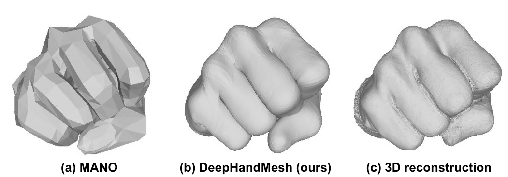
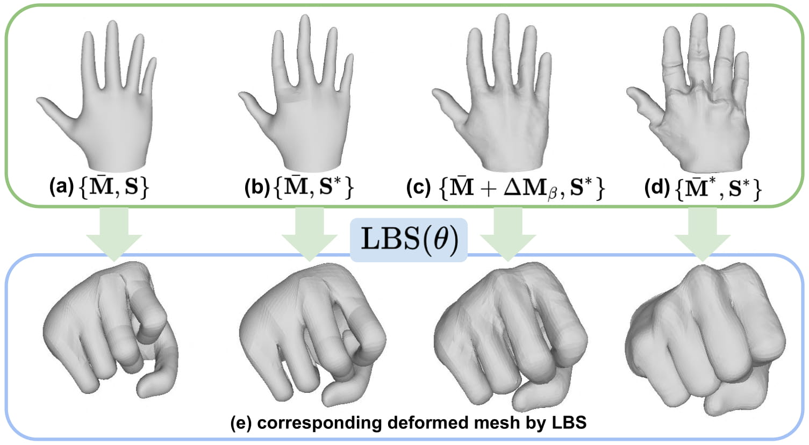
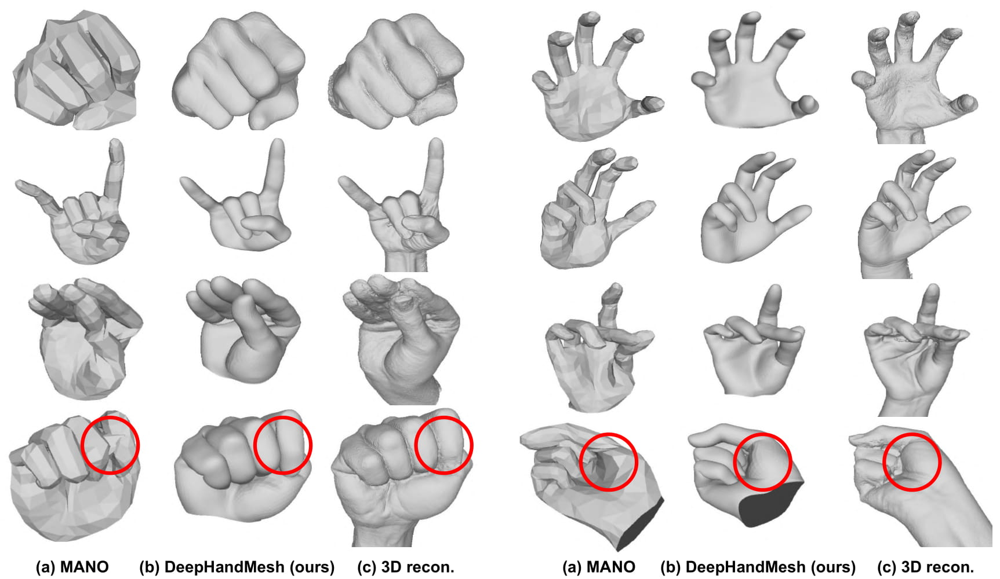

# DeepHandMesh: A Weakly-Supervised Deep Encoder-Decoder Framework for High-Fidelity Hand Mesh Modeling

<p align="center">  
  
</p> 

## Introduction
This repo is official **[PyTorch](https://pytorch.org)** implementation of **[DeepHandMesh: A Weakly-Supervised Deep Encoder-Decoder Framework for High-Fidelity Hand Mesh Modeling (ECCV 2020. Oral.)](https://arxiv.org/abs/2008.08213)**. 

## Demo
* Download pre-trained DeepHandMesh from [here](https://drive.google.com/drive/folders/1V4pY9bcmmPqsDW-4yj62ATCT7JdEz_5p?usp=sharing).
* Place the downloaded file at `demo/subject_${SUBJECT_IDX}` folder, where the filename is `snapshot_${EPOCH}.pth.tar`.
* Download hand model from [here](https://drive.google.com/file/d/1GTtkyuuIHbo188L0_d8DAmuJukoG-luJ/view?usp=sharing) and place it at `data` folder.
* Set hand joint Euler angles at [here](https://github.com/facebookresearch/DeepHandMesh/blob/508119e288ef35d4160043e5d3d174d2bf0d1873/demo/demo.py#L73).
* Run `python demo.py --gpu 0 --subject ${SUBJECT_IDX} --test_epoch ${EPOCH}`.

## DeepHandMesh dataset
* For the **DeepHandMesh dataset download and instructions**, go to [[HOMEPAGE](https://mks0601.github.io/DeepHandMesh/)]. 
* Belows are instructions for DeepHandMesh for the weakly-supervised high-fidelity 3D hand mesh modeling.

## Directory
### Root
The `${ROOT}` is described as below.
```
${ROOT}
|-- data
|-- common
|-- main
|-- output
|-- demo
```
* `data` contains data loading codes and soft links to images and annotations directories.
* `common` contains kernel codes.
* `main` contains high-level codes for training or testing the network.
* `output` contains log, trained models, visualized outputs, and test result.
* `demo` contains demo codes.

### Data
You need to follow directory structure of the `data` as below.
```
${ROOT}
|-- data
|   |-- images
|   |   |-- subject_1
|   |   |-- subject_2
|   |   |-- subject_3
|   |   |-- subject_4
|   |-- annotations
|   |   |-- 3D_scans_decimated
|   |   |   |-- subject_4
|   |   |-- depthmaps
|   |   |   |-- subject_4
|   |   |-- keypoints
|   |   |   |-- subject_4
|   |   |-- KRT_512
|   |-- hand_model
|   |   |-- global_pose.txt
|   |   |-- global_pose_inv.txt
|   |   |-- hand.fbx
|   |   |-- hand.obj
|   |   |-- local_pose.txt
|   |   |-- skeleton.txt
|   |   |-- skinning_weight.txt
```
* Download datasets and hand model from [[HOMEPAGE](https://mks0601.github.io/DeepHandMesh/)]. 

### Output
You need to follow the directory structure of the `output` folder as below.
```
${ROOT}
|-- output
|   |-- log
|   |-- model_dump
|   |-- result
|   |-- vis
```
* `log` folder contains training log file.
* `model_dump` folder contains saved checkpoints for each epoch.
* `result` folder contains final estimation files generated in the testing stage.
* `vis` folder contains visualized results.

## Running DeepHandMesh
### Prerequisites
* For the training, install neural renderer from [here](https://github.com/daniilidis-group/neural_renderer).
* After the install, uncomment line 12 of `main/model.py` (`from nets.DiffableRenderer.DiffableRenderer import RenderLayer`) and line 40 of `main/model.py` (`self.renderer = RenderLayer()`).
* If you want only testing, you do not have to install it.

### Start
* In the `main/config.py`, you can change settings of the model

### Train
In the `main` folder, run
```bash
python train.py --gpu 0-3 --subject 4
```
to train the network on the GPU 0,1,2,3. `--gpu 0,1,2,3` can be used instead of `--gpu 0-3`. You can use `--continue` to resume the training.
Only subject 4 is supported for the training.


### Test
Place trained model at the `output/model_dump/subject_${SUBJECT_IDX}`.

In the `main` folder, run 
```bash
python test.py --gpu 0-3 --test_epoch 4 --subject 4
```
to test the network on the GPU 0,1,2,3 with `snapshot_4.pth.tar`. `--gpu 0,1,2,3` can be used instead of `--gpu 0-3`.  
Only subject 4 is supported for the testing.
It will save images and output meshes.

## Results  
Here I report results of DeepHandMesh and pre-trained DeepHandMesh.

### Pre-trained DeepHandMesh
* Pre-trained DeepHandMesh [[Download](https://drive.google.com/drive/folders/1V4pY9bcmmPqsDW-4yj62ATCT7JdEz_5p?usp=sharing)]

### Effect of Identity- and Pose-Dependent Correctives
<p align="center">  
  
</p> 

### Comparison with MANO
<p align="center">  
  
</p> 

## Reference  
```  
@InProceedings{Moon_2020_ECCV_DeepHandMesh,  
author = {Moon, Gyeongsik and Shiratori, Takaaki and Lee, Kyoung Mu},  
title = {DeepHandMesh: A Weakly-supervised Deep Encoder-Decoder Framework for High-fidelity Hand Mesh Modeling},  
booktitle = {European Conference on Computer Vision (ECCV)},  
year = {2020}  
}  
```

## License
DeepHandMesh is CC-BY-NC 4.0 licensed, as found in the LICENSE file.
